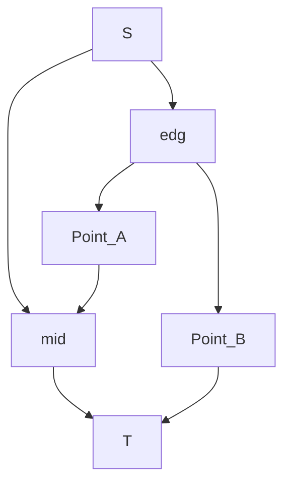

Here Point A are points unnecessary (s[i] = 0), and points B are points we need (s[i] = 1). edg are edges connect two points (either same kind or different). The capacity length are:

assert: m (number of edgs) >= sum (out[i])

out[i] = (deg[i] + a[i])/2

| Edge          | capacity                   |
| ------------- | -------------------------- |
| S - mid       | out[i] for each in Point_B |
| S - edg       | 1 for each in edgs         |
| edg - Point_A | 1 for each in edg          |
| Point_A - mid | deg[i] for each in Point_A |
| edg - Point_B | 1 for each in edg          |
| Point_B - T   | out[i] for each in Point_B |
| mid - T       | m (number of edgs)         |

Core: All output from S is sum{out} + m, and maximum input for T is also sum{out} + m. Thus, if there exists flow which network flow has ignored, output won't fix our expected value (sum{out} + m).